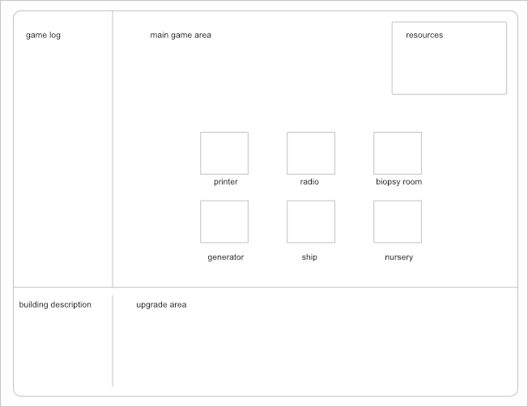
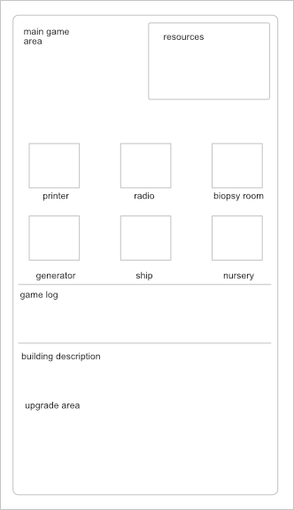
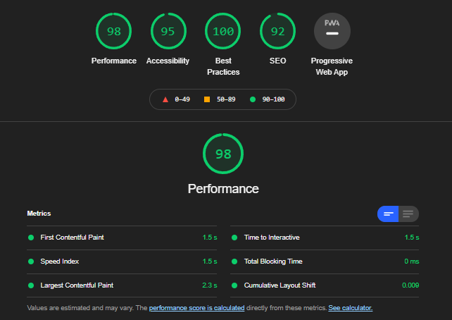
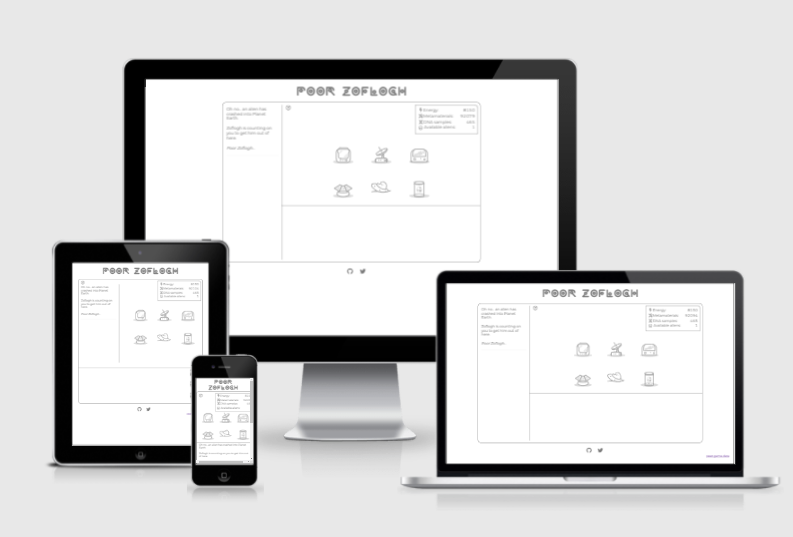

<!-- Using HTML tag to edit width of the logo -->


# Poor Zoflogh

Play the game [here](https://khalanar.github.io/poor-zoflogh/)

**Poor Zoflogh** is a browser based game in which the player has to rescue Zoflogh,  an alien who has crashed its spaceship into earth, by building a small colony on earth to reach out to its mother-ship, to get him rescued.

## User Experience (UX)
- User Stories
    - First Time Visitor Goals
        - As a First Time Visitor, I want to understand how to play.
        - As a First Time Visitor, I want to help rescue Zoflogh the alien.
        - As a First Time Visitor, I want the game to save my progress.
    - Returning Visitor Goals
        - As a Returning Visitor, I want the game load my last progress to continue helping Zoflogh
        - As a Returning Visitor, I want to be able to reset the game to wipe out my progress
        - As a Returning Visitor, I want to find Social Media links.

## Design
- Colour Scheme
    - A minimalistic approach to colors matches what we expect of a highly advanced interstellar race.
- Typography
    - Montserrat and variations provide a clean but modern aesthetic to the page.
    - *We Are Aliens* font for the logo gives strong 90s Sci Fi vibes
- Imagery
    - Clean SVG graphics for buildings help reinforce the idea of a highly advanced alien race. Why deal with *huge pixels* when you can *bezier* your way out of them? 

---

## Wireframes
- Game Sections
    - Main Game Area
    - Game Log
    - Upgrade area
    - Testimonials
- Screens - visible through the upgrade area
    - Ship
    - Generator
    - Printer
    - Biopsy Room
    - Nursery
    - Radio


### Main Wireframe

### Mobile Wireframe


---

## Features
- Text / icon based incremental web-game
- Story based
- Fully responsive
- Save and Load data to continue your game at any time

---

## Relevant Social Links
- Github
- Twitter
 
---

## Technologies
### Languages
- [HTML5](https://en.wikipedia.org/wiki/HTML5)
- [CSS3](https://en.wikipedia.org/wiki/CSS)
- [JS](https://en.wikipedia.org/wiki/JavaScript)


### Other Programs
- [Affinity Designer](https://affinity.serif.com/en-gb/) - Vector graphics
- [Git](https://git-scm.com/) - Version control and deployment
- [Balsamiq](https://balsamiq.com/) - Design wireframes
- [Visual Studio Code](https://code.visualstudio.com/) - IDE

---

## Testing

### HTML
- [HTML validator](https://validator.w3.org/)
    - No errors were found
    - 1 Warnings ignored - Lack of h1 under main-game-section is intentional
### CSS
- [CSS Validator](https://jigsaw.w3.org/css-validator/)
    - No errors were found
### JavaScript
- [JS Validator](https://jshint.com/)
    - No errors were found
### Accessibility
- #### Lighthouse
    

### Responsiveness
- #### Desktop | Laptop | Tablet | Smartphone
    

### Further Testing
Tested on Google Chrome, Internet Explorer, Microsoft Edge, Safari, Opera, Firefox and Brave.
Viewed on Desktop, Laptop, iPhone12, Nexus5X, Microsoft Surface Pro 4, Sony Xperia Z2.
Friends and family members were asked to review the site and documentation to point out any bugs and/or user experience issues.

### Testing User Stories from User Experience (UX) Section
1. First Time Visitor Goals
    - As a First Time Visitor, I want to understand how to play.
        - Upon entering the site, users are greeted with a clean and readable message that points them into next steps
        - A help icon is clearly visible should they require further assistance.
    - As a First Time Visitor, I want to help rescue Zoflogh the alien.
        - Through playing the game, the user gets closer to help Zoflogh.
    - As a First Time Visitor, I want the game to save my progress
        - Progress is saved after certain actions and every x milliseconds

2. Returning Visitor Goals
    - As a Returning Visitor, I want the game load my last progress to continue helping Zoflogh
        - The game loads save data automatically when the page is loaded
    - As a Returning Visitor, I want to be able to reset the game to wipe out my progress
        - A *reset game data* button is available for players to clear all progress
    - As a Returning Visitor, I want to find Social Media links.
        - Social Media links are available in the footer

---

## Deployment
### GitHub Pages

The project was deployed to GitHub Pages using the following steps...

1. Log in to GitHub and locate the [GitHub Repository](https://github.com/Khalanar/poor-zoflogh)
2. At the top of the Repository, click "Settings".
3. Scroll down the Settings page and click "Pages".
4. Under "Source", click "None" and select "Master Branch", the page will automatically refresh.
6. Scroll back down through the page to locate the now published site [link](https://khalanar.github.io/poor-zoflogh/) in the "GitHub Pages" section.

### Forking the GitHub Repository

By forking the GitHub Repository we make a copy of the original repository on our GitHub account to view and/or make changes without affecting the original repository by using the following steps...

1. Log in to GitHub and locate the [GitHub Repository](https://github.com/Khalanar/poor-zoflogh)
2. At the top of the Repository (not top of page) just above the "Settings" Button on the menu, locate the "Fork" Button.
3. You should now have a copy of the original repository in your GitHub account.

### Making a Local Clone

1. Log in to GitHub and locate the [GitHub Repository](https://github.com/Khalanar/poor-zoflogh)
2. Under the repository name, click "Clone or download".
3. To clone the repository using HTTPS, under "Clone with HTTPS", copy the link.
4. Open Git Bash
5. Change the current working directory to the location where you want the cloned directory to be made.
6. Type `git clone`, and then paste the URL you copied in Step 3.

```
$ git clone https://github.com/Khalanar/poor-zoflogh
```

7. Press Enter. Your local clone will be created.

```
$ git clone https://github.com/Khalanar/poor-zoflogh
> Cloning into `CI-Clone`...
> remote: Counting objects: 10, done.
> remote: Compressing objects: 100% (8/8), done.
> remove: Total 10 (delta 1), reused 10 (delta 1)
> Unpacking objects: 100% (10/10), done.
```

Click [Here](https://help.github.com/en/github/creating-cloning-and-archiving-repositories/cloning-a-repository#cloning-a-repository-to-github-desktop) to retrieve pictures for some of the buttons and more detailed explanations of the above process.

---

## Known Issues
- None
## Future Improvements
- Refactor JS code further

---
## Credits
### Media
- [We Are Alien](https://fontmeme.com/fonts/we-are-alien-font/) Font

---
## Changelog
- Fully deployed on 07 Sept 2021